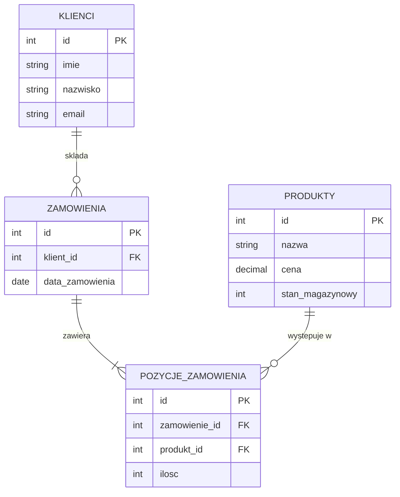

# Diagram ERD – sklep internetowy

Diagram związków encji dla przykładowej bazy danych. GitHub renderuje go automatycznie.

Wskazówka: na egzaminie warto umieć narysować taki diagram i zamienić go na polecenia `CREATE TABLE`.
