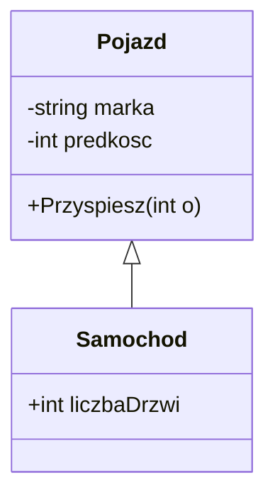

# Diagramy UML

Najważniejsze diagramy UML przydatne na egzaminie INF.04:

- **Diagram klas** – struktura klas, ich pola, metody i powiązania
- **Diagram przypadków użycia** – co użytkownik może zrobić w systemie
- **Diagram czynności** – przepływ działań / algorytm
- **Diagram sekwencji** – kolejność komunikacji między obiektami

## Przykład diagramu klas
GitHub renderuje poniższy diagram automatycznie:

